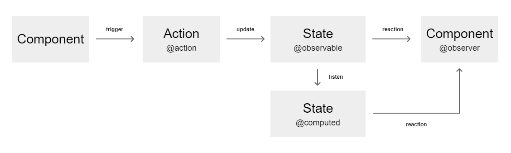
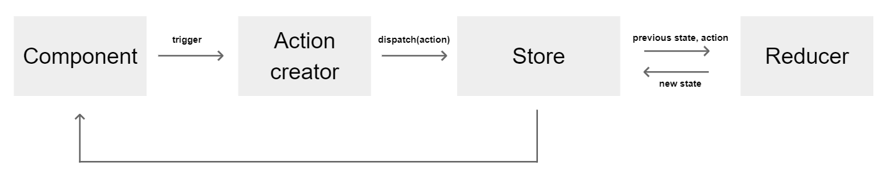

# State Management Tools Comparison


<div align="center">


</div>

If you are still not decided what state management library choose for your project ? You can find below a short comparison of two mainly used ones : Mobx, Redux.

## Table of content

- [Overview](#Overview)
- [Main stats](#Main-stats)
- [Installation](#Installation)
- [Features](#Features)
- [Structure](#Structure)
- [Usage](#Usage)


### Overview

At the time of writing this document, Mobx and Redux are the most popular state management frameworks. 
You can use Mobx/Redux with vanilla Javascript, React or even Angular - there exist bindings for each library to make it work with those store management tools.
Enclosed app example is an implementation of both with React, and gives a snapshot of complexity and structure you need to put in place to run your project (to see it in action, jump directly to [Usage](#Usage)
 part).
The analysis also takes into consideration Redux Toolkit, as new recommended way to write Redux logic.

|  | Mobx | Redux | Redux Toolkit |
| --- | --- | --- | --- |
| Release 1.0 | 13 Oct 2015 | 14 Aug 2015 | 23 Oct 2019 |
| Learning curve | shallow | steep | steep |
| Verbosity | low | high | low |
| Structure | simple | complex | simple |
| Multiple stores | yes | no | no |
| Mutability | mutable | immutable | immutable |
| Debugging | average | excellent | excellent |

Debugging - comparison based on daily development and tests done with 'Redux DevTools' and 'MobX Developer Tools' (extensions for Chrome).

### Main stats

| Mobx | Redux | Redux Toolkit |
| --- | --- | --- |
| https://github.com/mobxjs/mobx | https://github.com/reduxjs/redux | https://github.com/reduxjs/redux-toolkit |
| [](https://www.npmjs.com/package/mobx) | [](https://www.npmjs.com/package/redux) | [](https://www.npmjs.com/package/@reduxjs/toolkit) |
| [](https://lbesson.mit-license.org/) | [](https://lbesson.mit-license.org/) | [](https://lbesson.mit-license.org/) |
| [](https://github.com/mobxjs/mobx) | [](https://github.com/reduxjs/redux) | [](https://github.com/reduxjs/redux-toolkit) |
| [](https://github.com/mobxjs/mobx) | [](https://github.com/reduxjs/redux) | [](https://github.com/reduxjs/redux-toolkit) |
| [](https://github.com/mobxjs/mobx) | [](https://github.com/reduxjs/redux) | [](https://github.com/reduxjs/redux-toolkit) |
| [](https://github.com/mobxjs/mobx) | [](https://github.com/reduxjs/redux) | [](https://github.com/reduxjs/redux-toolkit) |
| [](https://www.npmjs.com/package/mobx) | [](https://www.npmjs.com/package/redux) | [](https://www.npmjs.com/package/@reduxjs/toolkit) |


### Installation

Integration with React:

#### Mobx
> `yarn add mobx`
> 
> `yarn add mobx-react`

> `yarn add @babel/plugin-proposal-decorators --dev` : dependency required to use decorators @observable, @computed, @action, @inject etc.
> 
> More about:
> https://babeljs.io/docs/en/babel-plugin-proposal-decorators
> https://mobx.js.org/enabling-decorators.html

#### Redux
> `yarn add redux`
> 
>  `yarn add react-redux`

#### Redux Toolkit
> `yarn add @reduxjs/toolkit`
> 
>  `yarn add react-redux`

More about add-ons:

---

> `mobx-react` : package with React component wrapper for combining React with MobX
> 
> More about:
> https://github.com/mobxjs/mobx-react

> `react-redux` : official React bindings for Redux
> 
> More about:
> https://react-redux.js.org/

### Features

Before exploring Mobx and Redux, here is a dictionary of common terms: 

- Store - holds the state of the application
- Components - dumb/presentational components (discover state through props passed as params)
- Containers - components aware of the store existence and interacts with it
- Action - function that trigger the state update (contains Type attribute that is used in Reducer)
- Action creator - function that returns an action object 
- Reducer - pure function that receives a state and action as arguments, copies the existing state and makes changes to the copied values (immutable update)
- Selector - function that computes derived data from the store
- Decorator - declaration that is used to modify class properties/methods
- Mutable -  state of an object  can be modified after object creation. In Mobx we modify state directly, mutating previous store value - example:
```javascript 
   this.todos.push({id: id, text, completed: false});
```

- Immutable - immutability is a core principle in functional programming, saying that the object state cannot be altered (example: primitive data types such as booleans, numbers, strings are already immutable, and objects or arrays not). 
In Redux, that term means the state becomes each time a brand new object instead of mutating the old store value - example:
```javascript 
    [
        ...state, { id: action.id, text: action.text, completed: false}
    ]
```

#### Mobx
Mobx gives possibility to define multiple stores and its state is mutable. 
Mobx's world is implicit where observable properties and actions update the store.

```javascript 
//TodoStore.js

//Trackable property
@observable todos = [];

...

//Action that modifies the state
@action addTodo (text= 'DUMMY TODO') {
    this.todos.push({id: nextTodoId++ , text, completed: false});
}

... 

//Derived value, cached until observable state updates
@computed get uncompletedTodosCount() {
    return this.todos.filter(todo => !todo.completed).length;
}
```

The store injection pattern used by the mobx-react makes easy linking the state to component:

```javascript 
//AddTodo.js

@inject('store')
class AddTodo extends Component {

    ...
 
    onFinish = values => {
        this.props.store.addTodo(values.todo);

        ...
    };
}
```

UI updates automatically thanks to `@observer` decorator that listens `@observable` updates:

```javascript 
//TodoList.js

@inject('store')
@observer
class TodoList extends Component {
    render() {
        ...
    };
}
```



<cite>Mobx flow</cite>

#### Redux
The core principles of Redux is only one store as the single source of truth.
The state is immutable which makes it more predictable. The structure of Redux is slightly more complex than in Mobx. 
Redux uses actions, action creators, reducers to update the data and requires much more effort to set it up initially.  
Updates have to be tracked manually using subscribers (@computed variables in Mobx) - subscriber triggers after the root reducer has returned a new state.

In Redux only way to update the store is to call an action. Example of an action creator - a factory that creates an action containing type and payload:

```javascript 
//actions/todo.js

export const addTodo = text => ({
    type: types.ADD_TODO,
    id: nextTodoId++,
    text
})

...
```
Dispatching action to the store using `dispatch` function from Redux to trigger store update:

```javascript 
//containers/AddTodo.js

const mapDispatchToProps = dispatch => ({
    addTodo: todo => dispatch(addTodo(todo))
});

...
```

Reducer is listening the events and handles actions based on action type, calculating the new state value with payload arguments:

```javascript 
//reducers/AddTodo.js

const todos = (state = [], action) => {
    switch (action.type) {
        case 'ADD_TODO':
            return [
                ...state,
                {
                    id: action.id,
                    text: action.text ? action.text : 'DUMMY TODO',
                    completed: false
                }
            ]
        
        ...

        default:
            return state
    }
}

...
```
Selector computes derived data (using reselect library) when state `getTodos` updates:

> More about:
> https://github.com/reduxjs/reselect
>
```javascript 
//selectors/index.js

import { createSelector } from 'reselect'

const getTodos = state => state.todos

export const getUncompletedTodosCount = createSelector(
    [getTodos],
    todos => (
        todos.reduce((count, todo) =>
                !todo.completed ? count + 1 : count,
            0
        )
    )
)
...
```


<cite>Redux flow</cite>


> In this example we didn't use Redux Thunk middleware that allows handle asynchronous requests.
> The middleware can be added as follows: 
> `yarn add redux-thunk`
>
> More about:
> https://github.com/reduxjs/redux-thunk

#### Redux Toolkit
As the time goes by, and one year means a century in web development world, a new package based on essential Redux features appeared in 2019, called Redux Toolkit.

> Redux Toolkit is our official, opinionated, batteries-included toolset for efficient Redux development.
> <cite>[https://redux.js.org/redux-toolkit](https://redux.js.org/redux-toolkit)</cite>

Redux Toolkit introduced slices, based on ducks modular pattern that holds reducers, action types and action creators inside one directory that represents the feature.
Library includes among other things Redux, Reselect, Redux-thunk and immer. Which is great, the tool cares of immutability itself making immutable changes with normal mutative code.
Before using Redux Toolkit you still need to know basics of Redux. The concept replies simply on most common issues raised against Redux like:

- store configuration is complicate
- code is verbose
- requires complex folder structure
- no clear best practices given to structure the code

The example of Slice from the application you can lunch following [Usage](#Usage) part:

```javascript 
//features/todos/todoSlice.js

const todosSlice = createSlice({
    name: 'todos',
    initialState: [],
    reducers: {
        addTodo: {
            reducer(state, action) {
                const { id, text = 'DUMMY TODO' } = action.payload

                state.push({ id, text, completed: false })
            },
            prepare(text) {
                return { payload: { text, id: nextTodoId++ } }
            }
        },
        toggleTodo(state, action) {
            const todo = state.find(todo => todo.id === action.payload)
            if (todo) {
                todo.completed = !todo.completed
            }
        }
    }
})
```

### Structure

Folder structures from each Store management tool:

#### Mobx

```text
app/
├─ components/
├─ containers/
├─ stores/
├─ ...
```
#### Redux

```text
app/
├─ actions/
├─ components/
├─ constants/
├─ containers/
├─ reducers/
├─ selectors/
├─ ...
```

#### Redux Toolkit

```text
app/
├─ components/
├─ features/
│     └─ feature_name
├─ ...
```

## Usage

Create a local repository and clone the code:

```sh
$ git clone https://github.com/KamilKubicki/react-mobx-redux-toolkit.git
```

Install dependencies:

```sh
$ yarn
```

Run the app:

```sh
$ yarn start
```

Navigating to https://localhost:3000 you should see the app main page.


