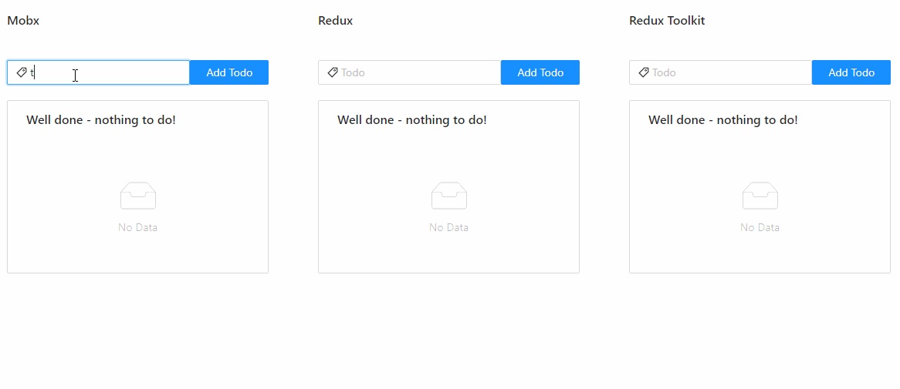

# State Management Tools Comparison


<div align="center">


    
</div>

If you are still not decided what state management library choose for your project ? You can find below a short comparison of two mainly used ones : Mobx, Redux.

## Table of content

- [Overview](#Overview)
- [Main stats](#Main-stats)
- [Installation](#Installation)
- [Structure](#Structure)
- [Usage](#Usage)


### Overview

At the time of writing this document, Mobx and Redux are the most popular state management frameworks. 
The implementation of both with React gives a snapshot of complexity and structure you need to put in place to run your project.
The analysis also takes into consideration Redux Toolkit, as new recommended way to write Redux logic.

|  | Mobx | Redux | Redux Toolkit |
| --- | --- | --- | --- |
| Release 1.0 | 13 Oct 2015 | 14 Aug 2015 | 23 Oct 2019 |
| Learning curve | shallow | steep | steep |
| Verbosity | low | high | low |
| Structure | simple | complex | simple |
| Multiple stores | yes | no | no |
| Debugging | average | excellent | excellent |

Debugging - comparison based on daily development and tests done with 'Redux DevTools' and 'MobX Developer Tools' (extensions for Chrome).

### Main stats

| Mobx | Redux | Redux Toolkit |
| --- | --- | --- |
| https://github.com/mobxjs/mobx | https://github.com/reduxjs/redux | https://github.com/reduxjs/redux-toolkit |
| [](https://www.npmjs.com/package/mobx) | [](https://www.npmjs.com/package/redux) | [](https://www.npmjs.com/package/@reduxjs/toolkit) |
| [](https://lbesson.mit-license.org/) | [](https://lbesson.mit-license.org/) | [](https://lbesson.mit-license.org/) |
| [](https://github.com/mobxjs/mobx) | [](https://github.com/reduxjs/redux) | [](https://github.com/reduxjs/redux-toolkit) |
| [](https://github.com/mobxjs/mobx) | [](https://github.com/reduxjs/redux) | [](https://github.com/reduxjs/redux-toolkit) |
| [](https://github.com/mobxjs/mobx) | [](https://github.com/reduxjs/redux) | [](https://github.com/reduxjs/redux-toolkit) |
| [](https://github.com/mobxjs/mobx) | [](https://github.com/reduxjs/redux) | [](https://github.com/reduxjs/redux-toolkit) |
| [](https://www.npmjs.com/package/mobx) | [](https://www.npmjs.com/package/redux) | [](https://www.npmjs.com/package/@reduxjs/toolkit) |


### Installation

Integration with React:

#### Mobx
> `yarn add mobx`
> 
>  `yarn add mobx-react`

#### Redux
> `yarn add redux`
> 
>  `yarn add react-redux`


#### Redux Toolkit
> `yarn add @reduxjs/toolkit`
> 
>  `yarn add react-redux`

More about add-ons:

> `mobx-react` : package with React component wrapper for combining React with MobX
> 
> More about:
> https://github.com/mobxjs/mobx-react

> `react-redux` : official React bindings for Redux
> 
> More about:
> https://react-redux.js.org/

### Structure

#### Mobx

```text
app/
├─ components/
├─ containers/
├─ stores/
├─ ...
```
#### Redux

```text
app/
├─ actions/
├─ components/
├─ constants/
├─ containers/
├─ reducers/
├─ selectors/
├─ ...
```

#### Redux Toolkit

```text
app/
├─ components/
├─ features/
│     └─ feature_name
├─ ...
```
## Usage

Create local repository and clone the code:

```sh
$ git clone https://github.com/KamilKubicki/react-mobx-redux-toolkit.git
```

Install dependencies:

```sh
$ yarn
```

Run the app:

```sh
$ yarn start
```

Navigating to https://localhost:3000 you should see the app main page.



